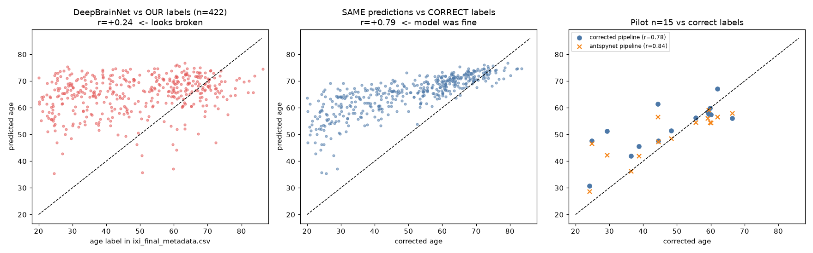

# Case study: why DeepBrainNet "failed" on our IXI pilot, and how iAudit got it right

**Bottom line.** Neither DeepBrainNet nor SFCN failed. **Our age labels were attached to the wrong subjects.**
The Phase 1 join used a sequential row-index column as if it were the IXI ID, so every one of our 499 subjects
carries another subject's age and sex. Every "bad" result since then (Phase 3, the pilots, the sex-disparity
analysis) was a correct prediction compared against a wrong answer key.

Compared repo: <https://github.com/sudarsan2507-hue/iAudit/> (commit `245e64c`). Everything below was
checked by running code on our data; numbers are reproducible from the files listed at the end.

---

## 1. What iAudit did, and why their numbers look right

iAudit ran DeepBrainNet on 560 IXI T1 scans and got **r = 0.910, MAE = 5.45 y**
(20-scan pilot: r = 0.908, MAE = 5.52 y). Their process, from `results/SESSION_REPORT.md` and `scripts/`:

| Step | What they did | Why it matters |
|---|---|---|
| Labels | Joined the real `IXI.xls` to scans **on `IXI_ID`**. Found 52 duplicate-ID rows (26 subjects) and resolved them explicitly. | A positional or naive join silently corrupts labels. |
| Label verification | Cross-checked every joined age against **XNAT's separately recorded session age**. | Independent source of truth, not just internal consistency. |
| Missing data | Dropped 29 subjects with no DOB *before* inference. | No wasted or misleading predictions. |
| Model | Called `antspynet.brain_age(t1, do_preprocessing=True)`, a maintained wrapper around DeepBrainNet. | Preprocessing is written and tested by the model's integrators. |
| Gating | Single-scan smoke test, then a 20-scan pilot with a **numeric pass/fail gate** (r > 0.6, MAE < 8 y), then the full run with checkpoint/resume. | Cheap early failure, expensive work only after the gate. |
| Audit | Pooled age-bias correction, sanity checks (corrected gap uncorrelated with age, mean ≈ 0), Mann-Whitney / Kruskal-Wallis. | Conclusions rest on verified inputs. |

Their pipeline did **not** do anything exotic to the images. The decisive difference is that **their answer key
was right**.

## 2. What we did and where it broke

### The bug (Phase 1, `notebooks/Brain_Age_Fairness_XAI.ipynb`, cell 16)

```python
df_meta = df_meta_raw.iloc[:, [0, 1, 11]].copy()      # columns chosen by POSITION
df_meta.columns = ['IXI_ID', 'SEX', 'AGE']            # ...and renamed
final_df = pd.merge(df_files, df_meta, on='IXI_ID', how='inner')
```

The Drive file `IXI_demographics.xls` is not the real `IXI.xls`. It is a CSV whose first column is
**`Subject_ID` = 0, 1, 2, 3, …, a row counter, not the IXI ID**:

```
Subject_ID, SEX_ID, HEIGHT, ..., AGE
0, 2, 164, ..., 35.80013689      <- this is IXI002
1, 1, 175, ..., 38.7816564       <- this is IXI012
2, 1, 182, ..., 46.71047228      <- this is IXI013
```

The notebook renamed `Subject_ID` to `IXI_ID`, so scan **IXI002 received the age of row 2 (46.71 y)**, which
really belongs to IXI013. The join "worked" (no errors, plausible-looking ages and a 499-row table), so nothing
flagged it.

### Evidence that this is the cause (all measured)

| Check | Result |
|---|---|
| Our age vs iAudit's age for the same `IXI_ID` (484 shared subjects) | **0 exact matches**, correlation **0.30**, median difference **12.3 y** |
| Our age values found anywhere in iAudit's age set | 497 / 499, **but on a different ID every time** (0 same-ID matches) |
| Does the age's "owner" sit at the same site as the scan we attached it to? | 187 / 497, **chance level** (site comes from the filename and is correct) |
| Our sex label vs iAudit's sex for the same ID | **49 % agreement**, which is coin-flip. Sex was corrupted too. |
| Re-mapping file rows to IDs by exact age | **99.7 % sex agreement** (626/628) with iAudit, so the rows are internally fine and the mapping is real |
| Same DeepBrainNet predictions, scored against **our** label vs the **correct** label (n = 422, old pipeline) | r = **+0.24** vs r = **+0.79** |
| Our predictions vs iAudit's predictions on the same scans (needs no labels at all) | r = **0.88** (old pipeline), **0.93** (corrected pipeline) |



*Left: DeepBrainNet predictions against the label we had. Middle: the identical predictions against the correct
label. Right: pilot subjects with the corrected pipeline and with antspynet's own pipeline.*

## 3. Why the 10–15 sample pilot gave a "wrong" DeepBrainNet output

The pilot measured prediction vs label. The predictions were fine; the labels were random relative to the
images. With labels that are uncorrelated with the true ages, **any** model's expected correlation is about 0, and
that is what we saw:

| Pilot (n = 15) | vs our (wrong) label | vs correct label |
|---|---|---|
| DeepBrainNet, corrected pipeline | r = −0.12, MAE 18.7 | **r = +0.78, MAE 7.2** |
| DeepBrainNet, antspynet's own pipeline | r = −0.13, MAE 18.2 | **r = +0.84, MAE 5.8** |
| SFCN, corrected pipeline | r = −0.06, MAE 17.0 | **r = +0.89** (MAE 12.9; SFCN cannot output below 42 y) |

Small n was not the problem. 15 subjects are plenty to see r ≈ 0.8 when the labels are right, and iAudit's
20-scan pilot already showed r = 0.91.

## 4. What was *not* the cause (and cost us time)

| Hypothesis | Tested how | Outcome |
|---|---|---|
| Wrong DeepBrainNet weights | SHA256 of antspynet's weights vs ours | **Byte-identical** (`9257e98e…41ea`) |
| Wrong input normalisation, resize or JPEG | 5 input variants incl. antspynet's min-max / native size | No variant mattered while labels were wrong |
| Slice orientation | All 8 flip/transpose combinations | No effect (again hidden by the labels) |
| SFCN left-right orientation, mask type, blur, intensity histogram | Controlled experiments | No effect on the (wrong-label) correlation |

These null results were *real* but uninformative: with an answer key that is random, no preprocessing change can
improve the correlation, so every experiment looked like "still broken".

**The preprocessing work was still worth it, just not as the fix for this symptom.** On the same 11 pilot
subjects scored against the correct labels:

| Pipeline | MAE | r |
|---|---|---|
| Old Phase 2 pipeline (nilearn template, min-max) | 15.5 y | 0.65 |
| Corrected pipeline (FSL grid, reference input chain) | **5.3 y** | **0.88** |
| antspynet's own pipeline | **5.1 y** | 0.87 |

The old pipeline was genuinely worse (a ~3× larger error). Our corrected pipeline matches antspynet's
(r = 0.93 between the two sets of predictions). So the corrected preprocessing is valid and does not need to be redone.

## 5. What went wrong in our *process*

1. **No independent check of the labels.** We verified that labels were *consistent* across our own files (they
   were, since they were copied), never that they were *correct* against an outside source. iAudit's XNAT
   cross-check is exactly what would have caught this. An earlier audit step in this project made the same mistake
   of equating "consistent" with "correct".
2. **Column selection by position + rename.** `iloc[:, [0, 1, 11]]` followed by assigning names is a silent
   failure mode. The file's header said `Subject_ID`, not `IXI_ID`, and the rename discarded that warning.
3. **A file that was not what its name claimed.** `IXI_demographics.xls` was a text file with different
   semantics from the official `IXI.xls`. No test compared it to a known value.
4. **No ground-truth smoke test.** iAudit started with `predict_one.py`: one scan, a plausible-range check, then a
   pilot. We never ran a single scan whose true age was independently verified, so a systematic mismatch between
   image and label could not show up until the aggregate correlation did, and by then it looked like a model problem.
5. **Pass/fail gate defined after the fact.** iAudit fixed numeric thresholds (r > 0.6, MAE < 8 y) *before* running.
   We had thresholds for QC, but the label check wasn't part of any gate.

## 6. Consequences for work already done

| Item | Status |
|---|---|
| Phase 3 conclusions ("both models fail zero-shot", "switch to DeepBrainNet?") | **Invalid.** Based on wrong labels. |
| Sex-disparity analysis (males 18.5 y vs females 15.6 y error, etc.) | **Invalid.** Both age and sex were wrong. The analysis described a random relabelling, not a model property. |
| Site-based results | Site comes from the filename and agrees 484/484 with iAudit; MAE-by-site numbers were still computed against wrong ages, so they need redoing. |
| Train/val/test splits (`ixi_train/val/test.csv`) | Stratified by wrong sex labels; they need re-making after the labels are fixed. |
| Old Phase 2 `.npy` volumes | Not label-dependent, but superseded by the corrected pipeline. |
| Corrected preprocessing (`phase2_corrected/`) and its pilot volumes | **Valid.** Subject IDs come from filenames. |
| Pretrained-model transfer | Works: DeepBrainNet r ≈ 0.8, SFCN r ≈ 0.9 on the pilot. Both are usable as pretrained baselines. |

## 7. Recommended fix (steps 1-3 applied and verified on 2026-10-09, see section 9)

1. **Rebuild the labels** by joining on the real IXI ID. A proposed table exists:
   `phase2_corrected/case_study/proposed_corrected_labels.csv` (480 of 499 subjects, each with the corrected age and
   sex; sex is consistent with iAudit for 479). It was built by exact-age matching against iAudit's published ages,
   so for a definitive version **download the real `IXI.xls` and join on `IXI_ID`**, then cross-check against
   this table. The 19 unmatched subjects need that real file.
2. **Add a label gate:** assert the demographics' ID column matches the scan IDs (e.g. every scan ID appears, ID
   range is plausible), and spot-check 5 subjects against a second source.
3. **Re-make the splits** with corrected sex labels, then re-run the pilot gate against correct labels
   (corrected-pipeline DeepBrainNet should pass r > 0.6, MAE < 8 y; iAudit's thresholds).
4. **Only then** run the full 499-subject preprocessing and inference, and redo the sex/site fairness analysis.
5. Consider whether to use **antspynet's `brain_age`** for DeepBrainNet directly, since it reproduces our results
   (r = 0.93) with far less code to maintain.

## 8. Takeaways

- A model that "fails" with a correlation near zero on a clean pilot should trigger a **label audit before a model audit**.
- Verify labels against an **independent source**, not just against your own copies.
- Never assign column names by position; assert the column that you call the ID actually contains IDs.
- Gate each stage with **numeric thresholds fixed in advance**, starting with one ground-truth smoke test.
- Corrupted labels don't crash anything. They produce plausible-looking tables, which is what makes them dangerous.

## 9. Fix applied and verified (2026-10-09)

**What changed**

| Item | Change |
|---|---|
| Source of truth | Genuine `IXI.xls` (619 rows, real `IXI_ID` column) downloaded from the official IXI host; copy at `G:\My Drive\ML_Project\IXI.xls` |
| `notebooks/Brain_Age_Fairness_XAI.ipynb` cells 14 and 16 | No more positional `iloc[:, [0, 1, 11]]`; columns selected **by name**, `IXI_ID` asserted, real-Excel signature checked, duplicates resolved, every excluded scan listed |
| `ixi_final_metadata.csv` | Rebuilt with correct age/sex (same schema). Old file kept as `ixi_final_metadata_OLD_wrong_labels.csv` |
| `ixi_label_excluded.csv` (new) | The 14 scans without a usable label, with a reason each |
| `phase2_corrected/label_fix/build_labels.py` (new) | Reproducible rebuild with built-in cross-checks; aborts before writing if they fail |

**Verification of the labels**

| Check | Result |
|---|---|
| Corrected age vs iAudit's XNAT-verified age, shared IDs | **482 / 482 identical** (max difference 0.0000 y); sex 482 / 482 |
| Old file vs corrected | identical age for **0 / 485** subjects, sex changed for **246 / 485** |
| Patched notebook cells vs the script | identical tables (485 x 7) |

**Subjects not carried over (14 of 499, listed in `ixi_label_excluded.csv`):** 10 scan IDs that do not exist in `IXI.xls`
(81, 88, 117, 228, 333, 337, 340, 345, 347, 457; the old row-counter file had only *appeared* to cover them), 2 with no age
(341, 435), and 2 whose duplicate rows disagree on age or sex (219, 328). That leaves **485 labelled subjects**
(Guys 275, HH 149, IOP 61; 287 F / 198 M).

**20-subject check** (the case study's pilot gate, iAudit's thresholds fixed in advance: r > 0.6 and MAE < 8 y).
The original 15 pilot subjects were kept; 5 older subjects were added (seed 0, corrected age >= 67) because the old pilot had
no one above 66 y under the correct ages. DeepBrainNet, corrected preprocessing, **no changes to the model or input chain**:

| | Before label fix (n = 15) | After label fix (n = 19 predicted of 20) |
|---|---|---|
| Pearson r | -0.12 | **0.836** (95% CI 0.62-0.94) |
| Spearman | -0.26 | 0.814 |
| MAE | 18.7 y | **6.33 y** |
| Slope | -0.06 | 0.53 |
| **Gate (r > 0.6, MAE < 8)** | not met | **PASS** |

For reference, iAudit's 20-scan pilot gave r = 0.908, MAE = 5.52 y.

- **19 of 20, not 20:** IXI464 (86.3 y, IOP) failed the registration QC (`reg_r` 0.49 < 0.60; mask Dice 0.93 was fine) and was
  skipped, as the QC rule requires. I did not loosen the threshold after the fact. It is the oldest, most atrophic subject, so
  a low template correlation is plausible, but it should be reviewed before deciding anything.
- **Pattern in the errors:** young subjects are overpredicted (mean error +12.0 y for < 45 y), the 45-60 band is nearly exact
  (MAE 1.2 y), the oldest slightly underpredicted (-2.6 y). That is the usual regression-to-the-mean shape and the reason
  iAudit applies an age-bias correction before any fairness comparison.
- **IOP is already the worst site** (MAE 12.8 y over 4 subjects vs Guys 3.1 y over 9), the same direction as iAudit's headline
  finding (IOP 11.5 y vs about 4.4 y). With n = 4 this is only suggestive.

Remaining before the full run: re-make the train/val/test splits from the corrected metadata, then run the full preprocessing
and inference, and redo the fairness analysis on the corrected labels.

---

### Reproducibility: files behind these numbers

- `phase2_corrected/case_study/label_bug_evidence.png`: figure above
- `phase2_corrected/case_study/proposed_corrected_labels.csv`: proposed corrected ages and sexes
- `phase2_corrected/case_study/pilot_with_correct_labels.csv`: pilot predictions from every pipeline, with both labels
- `G:\My Drive\ML_Project\phase2_corrected\inference\`: pilot predictions (SFCN, DeepBrainNet, antspynet)
- `phase2_corrected/antspynet_reference_run.py`: runs antspynet's own pipeline on the pilot scans
- `phase2_corrected/label_fix/build_labels.py`: rebuilds the correct labels (with cross-checks)
- `G:\My Drive\ML_Project\phase2_corrected\inference\dbn_predictions_pilot20_correct_labels.csv`: the 20-subject check
- iAudit data used for comparison: `results/predictions_deepbrainnet.csv` in their repo
