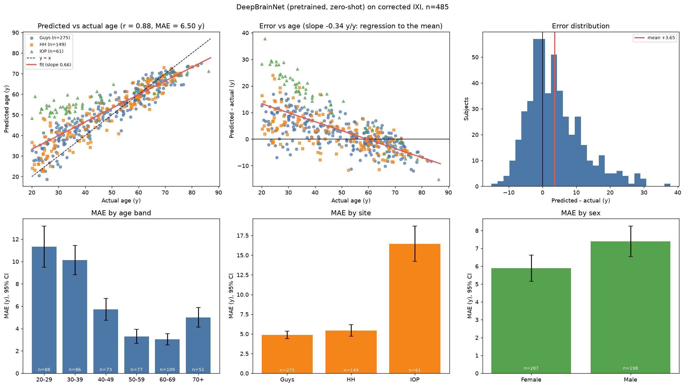

# Accuracy report: pretrained DeepBrainNet on corrected IXI (all_inclusive)

*Model:* DeepBrainNet `DBN_model.h5` (SHA256 `9257e98e…41ea`), **pretrained, no fine-tuning**, inference only.
*Input:* corrected preprocessing (FSL MNI152 grid, antspynet brain mask, reference slice chain; see `phase2_corrected/`).
*Labels:* rebuilt from the genuine `IXI.xls` joined on `IXI_ID` (verified identical to iAudit's XNAT-verified ages on 482/482 shared subjects).
*Predictions file:* `dbn_predictions_all.csv` | *Scope:* all predicted subjects (QC = PASS or WARN)

## 1. Headline

| Metric | Value |
|---|---|
| Subjects evaluated | **485** |
| **MAE** | **6.50 y** (95% bootstrap CI 5.95-7.09) |
| RMSE | 9.04 y |
| Median absolute error | 4.65 y |
| Mean error (bias, predicted - actual) | +3.65 y |
| Within 5 y / within 10 y | 53% / 79% |
| **Pearson r** | **0.877** (95% CI 0.855-0.896) |
| Spearman rho | 0.896 |
| R^2 | 0.770 |
| Slope of predicted on actual (1.0 = ideal) | 0.663 (intercept 20.0) |
| MAE after linear age-bias correction* | 4.48 y |

\*Correction `gap ~ age` fitted on this same sample (the standard approach, but optimistic; it removes the regression-to-the-mean trend).

**Reference:** iAudit reports r = 0.910, MAE = 5.45 y for antspynet's DeepBrainNet on 560 IXI scans (`results/` of github.com/sudarsan2507-hue/iAudit). Same weights (byte-identical file), different preprocessing wrapper and cohort filtering.

## 2. Cohort accounting (nothing silently dropped)

*QC policy note:* `reg_r` (T1-vs-template correlation) was demoted from a hard failure to a warning on 2026-10-09 after two of the first 25 scans
failed on it alone while their mask Dice was 0.93-0.95; no predictions for those scans had been seen. A strict (PASS-only) report is provided alongside.

- Scans in the raw folder index: **499**
- Excluded: no usable label (see `ixi_label_excluded.csv`): **14**
- Labelled subjects: **485**
- Failed hard preprocessing QC (not predicted): **0**
- Predicted with a QC warning (`reg_r` < 0.60 but mask Dice >= 0.80) - included: **38**
- Not yet preprocessed / no QC record: **0**
- **Predicted and evaluated**: 485

No subject failed hard preprocessing QC (every labelled subject was predicted).

## 3. Accuracy by age band

|  | n | MAE | RMSE | ME | within 5 y | within 10 y | r |
|---|---|---|---|---|---|---|---|
| 20-29 | 88 | 11.33 | 14.33 | +10.74 | 28% | 51% | 0.30 |
| 30-39 | 86 | 10.12 | 11.85 | +9.71 | 22% | 58% | 0.25 |
| 40-49 | 73 | 5.73 | 7.12 | +4.69 | 55% | 84% | 0.50 |
| 50-59 | 77 | 3.30 | 4.32 | +0.46 | 79% | 96% | 0.49 |
| 60-69 | 109 | 3.04 | 4.01 | -1.52 | 78% | 98% | 0.53 |
| 70+ | 51 | 5.00 | 5.91 | -4.93 | 51% | 94% | 0.52 |

Young subjects are over-predicted (mean error +9.2 y for < 45 y, n=215) and the oldest slightly under-predicted
(-2.6 y for >= 60 y, n=160): the usual regression-to-the-mean pattern of age regressors, visible as slope 0.66.

## 4. Accuracy by site and sex (descriptive)

|  | n | MAE | RMSE | ME | within 5 y | within 10 y | r |
|---|---|---|---|---|---|---|---|
| Guys | 275 | 4.87 | 6.24 | +1.92 | 59% | 87% | 0.94 |
| HH | 149 | 5.44 | 7.15 | +2.34 | 58% | 87% | 0.93 |
| IOP | 61 | 16.45 | 18.70 | +14.64 | 13% | 28% | 0.89 |

|  | n | MAE | RMSE | ME | within 5 y | within 10 y | r |
|---|---|---|---|---|---|---|---|
| Female | 287 | 5.89 | 8.63 | +2.67 | 61% | 83% | 0.87 |
| Male | 198 | 7.40 | 9.61 | +5.06 | 41% | 74% | 0.89 |

These are **unadjusted** group means. Sites and sexes differ in age mix, and error depends strongly on age, so group gaps here are not
evidence of bias. Significance testing and age/site adjustment belong to the separate fairness analysis.

## 5. Accuracy by split (all zero-shot, so splits are only a consistency check)

|  | n | MAE | RMSE | ME | within 5 y | within 10 y | r |
|---|---|---|---|---|---|---|---|
| test | 73 | 6.32 | 8.44 | +2.85 | 51% | 79% | 0.89 |
| train | 339 | 6.79 | 9.43 | +4.31 | 52% | 78% | 0.86 |
| val | 73 | 5.37 | 7.65 | +1.37 | 58% | 88% | 0.90 |

## 6. Ten largest errors

| IXI_ID | site | sex | actual_age | predicted_age | error |
|---|---|---|---|---|---|
| 230 | IOP | Female | 21.2 | 58.9 | 37.8 |
| 331 | IOP | Male | 23.5 | 53.0 | 29.6 |
| 303 | IOP | Male | 25.5 | 54.7 | 29.3 |
| 292 | IOP | Female | 23.7 | 52.8 | 29.1 |
| 553 | IOP | Male | 28.2 | 57.1 | 28.9 |
| 425 | IOP | Female | 20.0 | 48.3 | 28.4 |
| 426 | IOP | Female | 23.1 | 51.3 | 28.2 |
| 371 | IOP | Female | 26.4 | 54.4 | 28.0 |
| 315 | IOP | Female | 25.5 | 53.3 | 27.9 |
| 388 | IOP | Male | 33.3 | 59.7 | 26.4 |

## 7. Interpretation and limitations

- The pretrained model tracks age on corrected labels (r = 0.88), confirming the earlier "failure" was a label bug, not a model problem.

- Errors are not uniform across age: see section 3. A flat MAE would hide this.
- Zero-shot: no domain adaptation to IXI scanners (Guys/HH Philips, IOP GE), which is expected to affect IOP most.
- Selection: subjects without usable labels or failing QC are excluded (section 2); results describe the evaluated subset.
- Age-bias correction is fitted in-sample, so the corrected MAE is optimistic.
- Single model; the preprocessing differs from antspynet's and from the original authors', so absolute numbers are not directly comparable.
