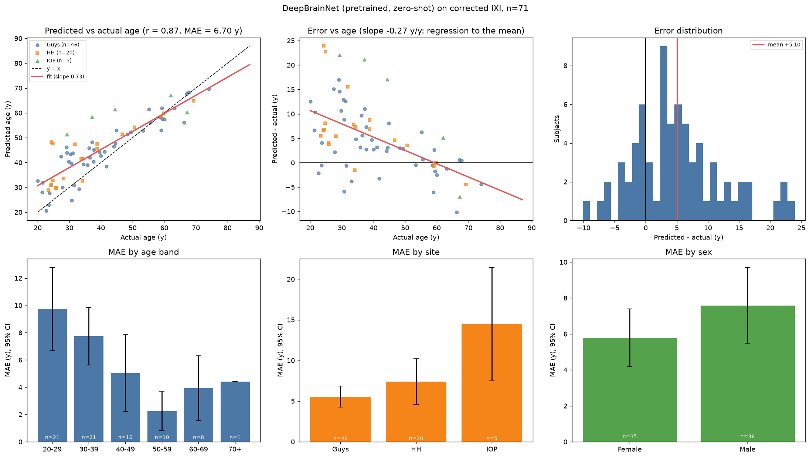

# Accuracy report: pretrained DeepBrainNet on corrected IXI (quick71)

*Model:* DeepBrainNet `DBN_model.h5` (SHA256 `9257e98e…41ea`), **pretrained, no fine-tuning**, inference only.
*Input:* corrected preprocessing (FSL MNI152 grid, antspynet brain mask, reference slice chain; see `phase2_corrected/`).
*Labels:* rebuilt from the genuine `IXI.xls` joined on `IXI_ID` (verified identical to iAudit's XNAT-verified ages on 482/482 shared subjects).
*Predictions file:* `dbn_predictions_quick71.csv` | *Scope:* all predicted subjects (QC = PASS or WARN)

## 1. Headline

| Metric | Value |
|---|---|
| Subjects evaluated | **71** |
| **MAE** | **6.70 y** (95% bootstrap CI 5.45-8.09) |
| RMSE | 8.81 y |
| Median absolute error | 5.10 y |
| Mean error (bias, predicted - actual) | +5.10 y |
| Within 5 y / within 10 y | 49% / 77% |
| **Pearson r** | **0.871** (95% CI 0.800-0.918) |
| Spearman rho | 0.851 |
| R^2 | 0.759 |
| Slope of predicted on actual (1.0 = ideal) | 0.728 (intercept 16.1) |
| MAE after linear age-bias correction* | 4.43 y |

\*Correction `gap ~ age` fitted on this same sample (the standard approach, but optimistic; it removes the regression-to-the-mean trend).

**Reference:** iAudit reports r = 0.910, MAE = 5.45 y for antspynet's DeepBrainNet on 560 IXI scans
(`results/` of github.com/sudarsan2507-hue/iAudit). Same weights (byte-identical file), different preprocessing wrapper and cohort filtering.

## 2. Cohort accounting (nothing silently dropped)

*QC policy note:* `reg_r` (T1-vs-template correlation) was demoted from a hard failure to a warning on 2026-10-09 after two of the first 25 scans
failed on it alone while their mask Dice was 0.93-0.95; no predictions for those scans had been seen. A strict (PASS-only) report is provided alongside.

- Scans in the raw folder index: **499**
- Excluded: no usable label (see `ixi_label_excluded.csv`): **14**
- Labelled subjects: **485**
- Failed hard preprocessing QC (not predicted): **3**
- Predicted with a QC warning (`reg_r` < 0.60 but mask Dice >= 0.80) - included: **2**
- Not yet preprocessed / no QC record: **413**
- **Predicted and evaluated**: 71

**QC-failed subjects (not predicted):** IXI016 (nan), IXI019 (nan), IXI464 (reg_r 0.49)

## 3. Accuracy by age band

|  | n | MAE | RMSE | ME | within 5 y | within 10 y | r |
|---|---|---|---|---|---|---|---|
| 20-29 | 21 | 9.75 | 11.95 | +9.50 | 29% | 57% | 0.57 |
| 30-39 | 21 | 7.74 | 9.11 | +6.62 | 33% | 76% | 0.51 |
| 40-49 | 10 | 5.04 | 6.62 | +4.38 | 80% | 90% | 0.59 |
| 50-59 | 10 | 2.25 | 3.16 | +0.37 | 80% | 100% | 0.47 |
| 60-69 | 8 | 3.93 | 5.07 | -2.40 | 62% | 88% | 0.33 |
| 70+ | 1 | 4.42 | 4.42 | -4.42 | 100% | 100% | nan |

Young subjects are over-predicted (mean error +7.6 y for < 45 y, n=49) and the oldest slightly under-predicted
(-2.6 y for >= 60 y, n=9): the usual regression-to-the-mean pattern of age regressors, visible as slope 0.73.

## 4. Accuracy by site and sex (descriptive)

|  | n | MAE | RMSE | ME | within 5 y | within 10 y | r |
|---|---|---|---|---|---|---|---|
| Guys | 46 | 5.56 | 7.13 | +3.68 | 59% | 78% | 0.91 |
| HH | 20 | 7.40 | 9.67 | +6.74 | 40% | 85% | 0.86 |
| IOP | 5 | 14.46 | 16.11 | +11.68 | 0% | 40% | 0.76 |

|  | n | MAE | RMSE | ME | within 5 y | within 10 y | r |
|---|---|---|---|---|---|---|---|
| Female | 35 | 5.80 | 7.51 | +4.29 | 54% | 83% | 0.89 |
| Male | 36 | 7.59 | 9.91 | +5.89 | 44% | 72% | 0.86 |

These are **unadjusted** group means. Sites and sexes differ in age mix, and error depends strongly on age, so group gaps here are not
evidence of bias. Significance testing and age/site adjustment belong to the separate fairness analysis.

## 5. Accuracy by split (all zero-shot, so splits are only a consistency check)

|  | n | MAE | RMSE | ME | within 5 y | within 10 y | r |
|---|---|---|---|---|---|---|---|
| test | 9 | 5.53 | 6.02 | +1.60 | 44% | 89% | 0.92 |
| train | 55 | 6.87 | 9.20 | +5.63 | 49% | 76% | 0.87 |
| val | 7 | 6.88 | 8.62 | +5.46 | 57% | 71% | 0.90 |

## 6. Ten largest errors

| IXI_ID | site | sex | actual_age | predicted_age | error |
|---|---|---|---|---|---|
| 15 | HH | Male | 24.3 | 48.2 | 23.9 |
| 94 | HH | Male | 24.9 | 47.6 | 22.7 |
| 372 | IOP | Male | 29.3 | 51.3 | 22.1 |
| 35 | IOP | Female | 37.1 | 58.3 | 21.1 |
| 542 | IOP | Female | 44.4 | 61.4 | 17.0 |
| 17 | Guys | Female | 29.1 | 46.1 | 17.0 |
| 49 | HH | Male | 31.9 | 47.4 | 15.5 |
| 41 | Guys | Male | 27.4 | 42.5 | 15.1 |
| 58 | Guys | Male | 29.3 | 43.9 | 14.6 |
| 27 | Guys | Male | 30.4 | 43.3 | 12.9 |

## 7. Interpretation and limitations

- The pretrained model tracks age on corrected labels (r = 0.87), confirming the earlier "failure" was a label bug, not a model problem.
- Errors are not uniform across age: see section 3. A flat MAE would hide this.
- Zero-shot: no domain adaptation to IXI scanners (Guys/HH Philips, IOP GE), which is expected to affect IOP most.
- Selection: subjects without usable labels or failing QC are excluded (section 2); results describe the evaluated subset.
- Age-bias correction is fitted in-sample, so the corrected MAE is optimistic.
- Single model; the preprocessing differs from antspynet's and from the original authors', so absolute numbers are not directly comparable.
