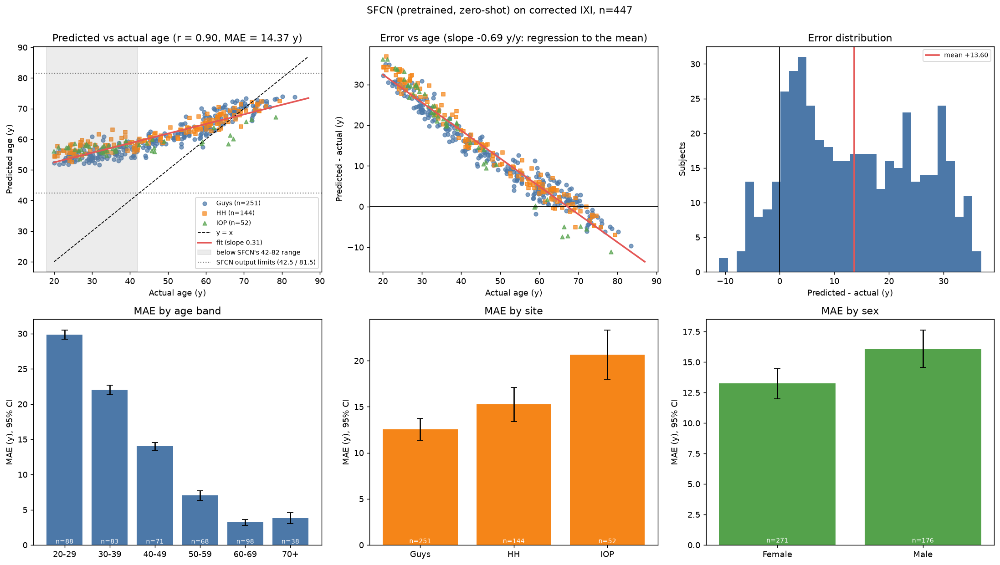

# Accuracy report: pretrained SFCN on corrected IXI (sfcn_all_strict)

*Model:* SFCN `run_20190719_00_epoch_best_mae.p` (UK Biobank, Peng et al. 2021); output = expected value over 40 one-year bins, so predictions are limited to 42.5-81.5 y, **pretrained, no fine-tuning**, inference only.
*Input:* corrected preprocessing (FSL MNI152 grid, antspynet brain mask, reference slice chain; see `phase2_corrected/`).
*Labels:* rebuilt from the genuine `IXI.xls` joined on `IXI_ID` (verified identical to iAudit's XNAT-verified ages on 482/482 shared subjects).
*Predictions file:* `sfcn_predictions_all.csv` | *Scope:* strict (QC = PASS only)

## 1. Headline

| Metric | Value |
|---|---|
| Subjects evaluated | **447** |
| **MAE** | **14.37 y** (95% bootstrap CI 13.42-15.32) |
| RMSE | 17.83 y |
| Median absolute error | 12.69 y |
| Mean error (bias, predicted - actual) | +13.60 y |
| Within 5 y / within 10 y | 27% / 44% |
| **Pearson r** | **0.904** (95% CI 0.886-0.920) |
| Spearman rho | 0.899 |
| R^2 | 0.818 |
| Slope of predicted on actual (1.0 = ideal) | 0.313 (intercept 46.2) |
| MAE after linear age-bias correction* | 1.96 y |

\*Correction `gap ~ age` fitted on this same sample (the standard approach, but optimistic; it removes the regression-to-the-mean trend).

### SFCN accuracy inside and outside its output range

SFCN can only output 42.5-81.5 y (40 one-year bins, `bin_range = [42, 82]` in the official example), so the fair test is subjects aged 42-82. Subjects under 42 cannot be predicted correctly by construction; their error is a property of the output design.

| Subset | n | MAE | RMSE | bias | Pearson r | Spearman |
|---|---|---|---|---|---|---|
| all subjects | 447 | 14.37 | 17.83 | +13.60 | 0.904 | 0.899 |
| **age 42-82 (in range)** | 253 | 6.30 | 7.74 | +5.01 | 0.865 | 0.872 |
| age < 42 (out of range) | 193 | 24.98 | 25.64 | +24.98 | 0.337 | 0.336 |

For comparison, DeepBrainNet on the same in-range subjects: see `accuracy_report_all_inclusive.md`.

## 2. Cohort accounting (nothing silently dropped)

*QC policy note:* `reg_r` (T1-vs-template correlation) was demoted from a hard failure to a warning on 2026-10-09 after two of the first 25 scans
failed on it alone while their mask Dice was 0.93-0.95; no predictions for those scans had been seen. A strict (PASS-only) report is provided alongside.

- Scans in the raw folder index: **499**
- Excluded: no usable label (see `ixi_label_excluded.csv`): **14**
- Labelled subjects: **485**
- Failed hard preprocessing QC (not predicted): **0**
- Predicted with a QC warning (`reg_r` < 0.60 but mask Dice >= 0.80) - **excluded in this strict report**: **38**
- Not yet preprocessed / no QC record: **0**
- **Predicted and evaluated**: 447

No subject failed hard preprocessing QC (every labelled subject was predicted).

## 3. Accuracy by age band

|  | n | MAE | RMSE | ME | within 5 y | within 10 y | r |
|---|---|---|---|---|---|---|---|
| 20-29 | 88 | 29.87 | 30.03 | +29.87 | 0% | 0% | 0.18 |
| 30-39 | 83 | 22.02 | 22.23 | +22.02 | 0% | 0% | 0.30 |
| 40-49 | 71 | 14.01 | 14.20 | +14.01 | 0% | 4% | 0.54 |
| 50-59 | 68 | 7.02 | 7.58 | +6.96 | 25% | 87% | 0.38 |
| 60-69 | 98 | 3.21 | 3.81 | +2.59 | 80% | 100% | 0.54 |
| 70+ | 38 | 3.81 | 4.49 | -3.56 | 71% | 97% | 0.47 |

Young subjects are over-predicted (mean error +24.0 y for < 45 y, n=212) and the oldest slightly under-predicted
(+0.9 y for >= 60 y, n=136): the usual regression-to-the-mean pattern of age regressors, visible as slope 0.31.

## 4. Accuracy by site and sex (descriptive)

|  | n | MAE | RMSE | ME | within 5 y | within 10 y | r |
|---|---|---|---|---|---|---|---|
| Guys | 251 | 12.57 | 15.80 | +11.86 | 31% | 50% | 0.93 |
| HH | 144 | 15.24 | 19.05 | +14.66 | 28% | 44% | 0.92 |
| IOP | 52 | 20.64 | 22.84 | +19.07 | 10% | 17% | 0.77 |

|  | n | MAE | RMSE | ME | within 5 y | within 10 y | r |
|---|---|---|---|---|---|---|---|
| Female | 271 | 13.25 | 16.91 | +12.34 | 31% | 50% | 0.89 |
| Male | 176 | 16.09 | 19.16 | +15.54 | 22% | 35% | 0.92 |

These are **unadjusted** group means. Sites and sexes differ in age mix, and error depends strongly on age, so group gaps here are not
evidence of bias. Significance testing and age/site adjustment belong to the separate fairness analysis.

## 5. Accuracy by split (all zero-shot, so splits are only a consistency check)

|  | n | MAE | RMSE | ME | within 5 y | within 10 y | r |
|---|---|---|---|---|---|---|---|
| test | 65 | 13.70 | 17.35 | +12.48 | 31% | 51% | 0.91 |
| train | 312 | 15.25 | 18.54 | +14.75 | 23% | 39% | 0.90 |
| val | 70 | 11.08 | 14.76 | +9.49 | 44% | 60% | 0.89 |

## 6. Ten largest errors

| IXI_ID | site | sex | actual_age | predicted_age | error |
|---|---|---|---|---|---|
| 276 | HH | Male | 20.9 | 57.8 | 36.9 |
| 230 | IOP | Female | 21.2 | 57.4 | 36.3 |
| 425 | IOP | Female | 20.0 | 56.2 | 36.2 |
| 70 | Guys | Female | 20.7 | 55.7 | 35.0 |
| 21 | Guys | Female | 21.6 | 56.4 | 34.9 |
| 202 | HH | Male | 20.2 | 54.5 | 34.3 |
| 80 | HH | Female | 21.2 | 55.5 | 34.3 |
| 278 | HH | Male | 20.2 | 54.4 | 34.2 |
| 426 | IOP | Female | 23.1 | 57.2 | 34.1 |
| 201 | HH | Female | 22.4 | 56.2 | 33.8 |

## 7. Interpretation and limitations

- The pretrained model tracks age on corrected labels (r = 0.90), confirming the earlier "failure" was a label bug, not a model problem.
- SFCN's overall MAE is dominated by subjects under 42, which lie outside its 42-82 output range; judge it on the in-range table above.
- Errors are not uniform across age: see section 3. A flat MAE would hide this.
- Zero-shot: no domain adaptation to IXI scanners (Guys/HH Philips, IOP GE), which is expected to affect IOP most.
- Selection: subjects without usable labels or failing QC are excluded (section 2); results describe the evaluated subset.
- Age-bias correction is fitted in-sample, so the corrected MAE is optimistic.
- Single model; the preprocessing differs from antspynet's and from the original authors', so absolute numbers are not directly comparable.
